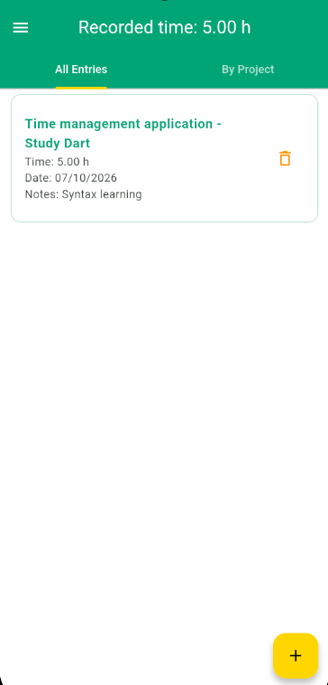
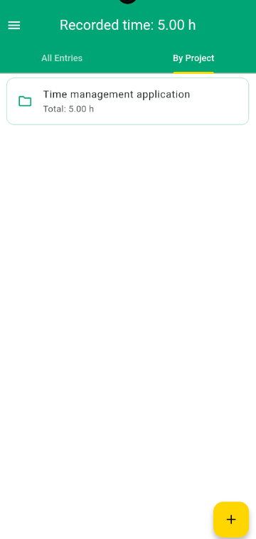
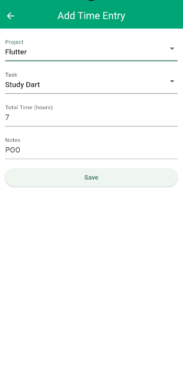
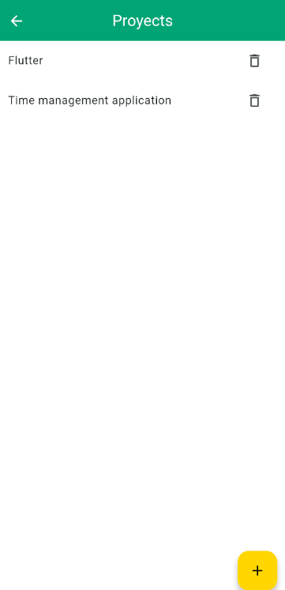
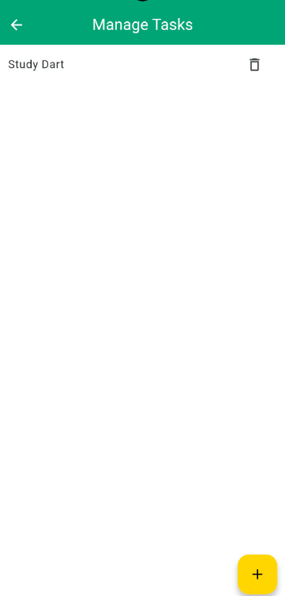

Control del tiempo
Aplicación desarrollada con Flutter y Dart para registrar las horas dedicadas a proyectos y tareas, consultar el tiempo acumulado y conservar los datos mediante almacenamiento local.
Estado: beta funcional. Las funciones actuales han sido comprobadas manualmente por el desarrollador.
Funcionalidades
- Creación y consulta de proyectos y tareas.
- Registro de horas con proyecto, tarea, fecha y notas.
- Validación de campos obligatorios y horas positivas y finitas.
- Vista de registros en tarjetas con nombres de proyecto y tarea.
- Total general de horas y resumen de horas por proyecto.
- Eliminación de registros con un aviso en pantalla.
- Eliminación de proyectos y tareas sin registros asociados; bloqueo de la eliminación cuando están en uso.
- Estados vacíos con una indicación para añadir el primer registro.
- Menú lateral para acceder a la gestión de proyectos y tareas.
- Formulario desplazable para utilizarlo con el teclado abierto.
- Persistencia local de proyectos, tareas y registros al cerrar y reabrir la aplicación.
Capturas
Capturas pendientes de incorporar al repositorio.

### Registros de tiempo

  

### Horas por proyecto

 

 ### Nuevo registro

  

### Gestión de proyectos y tareas

 
 

Descargar la beta
El APK para Android se publicará en Releases de este repositorio.
Cuando esté disponible:
1. Abre la sección Releases del repositorio.
2. Selecciona la versión de la beta.
3. Descarga el archivo .apk desde Assets.
4. Abre el archivo en tu dispositivo Android y completa la instalación.
Si Android lo solicita, permite la instalación desde la aplicación utilizada para abrir el APK.
<!-- Cuando publiques la beta, sustituye el anuncio por un enlace a la release y elimina la indicación de publicación pendiente. -->

Tecnologías
Tecnología	Uso
Flutter y Dart	Interfaz, modelos y lógica
Provider	Gestión de estado y actualización de la interfaz
Localstorage	Persistencia local
dart:convert	Serialización y deserialización JSON
Intl	Formato de fechas

Ejecutar el proyecto
Requisitos
- Flutter instalado, con su Dart SDK.
- Una versión de Dart compatible con pubspec.yaml.
- SDK de Android y un dispositivo físico o emulador para ejecutar en Android.
Comprueba el entorno:
flutter doctor
Descarga o clona este repositorio y abre una terminal en la carpeta que contiene pubspec.yaml. Después ejecuta:
flutter pub get
flutter run
Para revisar el código con el analizador:
flutter analyze
Uso
1. Crea un proyecto y una tarea desde el menú lateral.
2. Pulsa + en la pantalla principal.
3. Selecciona el proyecto y la tarea e ingresa las horas y las notas.
4. Guarda el registro y consulta su tarjeta en All Entries.
5. Abre Por proyecto para consultar los totales acumulados.
Utiliza un punto como separador decimal: 1.5 equivale a una hora y media. Las notas son obligatorias en el formulario actual.
Estructura
Ruta	Responsabilidad
lib/main.dart	Inicialización y registro de providers
lib/models/	Modelos Project, Task y TimeEntry
lib/provider/	Gestión de datos, cálculos y almacenamiento
lib/screens/	Pantallas, formularios y navegación
lib/widgets/	Widgets reutilizables

Los registros relacionan proyectos y tareas mediante sus identificadores. Los providers gestionan las listas, guardan los cambios y notifican a la interfaz mediante ChangeNotifier.
Los modelos usan toJson() y fromJson() para convertir objetos y mapas. Los datos se almacenan como texto JSON. Los totales se calculan a partir de los registros, sin guardar una copia independiente del resumen.
Generar el APK
Con el entorno Android configurado, ejecuta desde la raíz del proyecto:
flutter build apk --release
El archivo generado normalmente se encuentra en:
build/app/outputs/flutter-apk/app-release.apk
Este archivo se adjuntará a la versión correspondiente en Releases. Para distribuir actualizaciones, se debe conservar la configuración de firma utilizada.
Alcance de la beta
La aplicación almacena la información localmente. No incluye cuentas de usuario, servidor ni sincronización entre dispositivos.
La pestaña Por proyecto muestra los totales de horas; todavía no presenta las entradas individuales agrupadas. La interfaz combina algunos textos en español e inglés.
Próximas mejoras
- Edición de registros, proyectos y tareas.
- Entradas individuales agrupadas por proyecto.
- Confirmación o posibilidad de deshacer una eliminación.
- Exportación y copias de seguridad.
- Unificación del idioma de la interfaz.
- Pruebas automatizadas y manejo de errores del almacenamiento.
Sobre el proyecto
Proyecto de aprendizaje y portafolio desarrollado para practicar Flutter, Dart, gestión de estado, formularios, navegación y persistencia local, construyendo una aplicación funcional de forma progres
